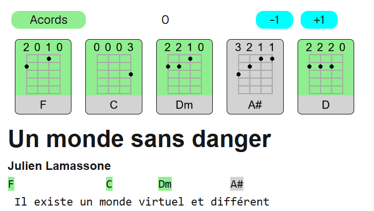

# Ajudant musical (nom temporal)

Aquesta aplicació neix amb un objectiu força simple. És útil tenir tots els acords de les cançons que un toca _(en el meu cas, de forma més que amateur)_, i algunes eines addicionals. Tanmateix, l'aplicació que vaig trobar i que segurament és de les més importants mundialment té diversos problemes. En primer lloc, que quan passes un temps sense obrir-la, et comença a bombardejar amb missatges sobre les subscripcions de pagament, que gairebé et surt més a compte anar a buscar les 7 boles de drac que tancar-los un per un. La versió de pagament també té alguna de les funcionalitats importants. Un també troba l'extrem contrari, webs on hi ha acords sense cap mena de formatació ni eina addicional.

Amb tot això, un comença a pensar i es planteja si hi hauria alguna alternativa millor, i em vaig dir: "Si vols alguna cosa ben feta, fes-la tu".

## Estructura tècnica

De moment, els arxius importants es troben al directori `data/`. Tot i això, es pot definir una ruta alternativa (veure .env.example), que complementa aquest directori, els registres d'aquest extra es fusionen sobre `data/`. Aquí hi ha diversos arxius:

- [acords.yml](/data/acords.yml): Inclou la informació sobre quins acords sé fer per mostrar-los de colors i identificar com de factible serà provar una cançó. També conté informació tècnica dels acords.
  - Estats: 0 (En progrés), 1 (Dominat), 2 (Millor no intentar-lo)
- [index.yml](/data/index.yml), un arxiu que serveix d'índex per a poder veure ràpidament quines cançons tinc i en un futur poder classificar-les:
- Les cançons han d'estar en arxius anomenats `<id>.md`, en un format força compatible a Markdown (#/## per a títols, https per a enllaços). A grosso modo, es divideix en files d'acords i files de text. És important que als ponts instrumentals hi hagi dos espais entre els acords, no un, perquè hi hagi lloc per a posar els sostinguts en trasposar sense que s'enganxi tot. `G  D  C  G  x2`. També es poden requadrar blocs antecedint totes les seves línies per `>`.

## Com començar?

- Instal·lar bun: https://bun.com/
- Instal·lar les dependències necessàries executant la comanda `bun i` al directori de treball.
- Afegir els arxius .md i .yml necessaris (per temes de drets, no m'atreveixo a penjar cap lletra)
- Opció 1: `bun dev`: Útil si vols fer modificacions en temps real.
- Opció 2: `bun run build` i `bun start`: Útil per a treballar a llarg termini, hauria de ser més ràpid.

## Requisits python

PIL (pillow), pyyaml, mypy (per a anàlisi estàtica).

[Millor em dedico a les matemàtiques](https://www.youtube.com/watch?v=NlRPtFoM-d8)

_(c) Joaquín Millán Aldaz (2026)_
